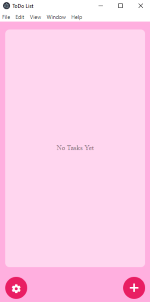
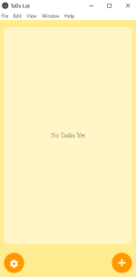
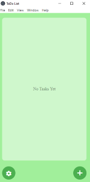
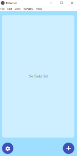
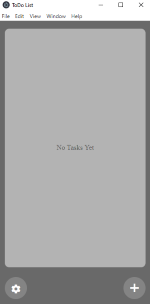

# ToDo_List
it's a Simple ToDo List, Easy To Use Yet Helpful.


It's Built Using Electron Framework And Web Techniques

## Run It
Run This Command in The HTML-file Directory
```bash
npm start
```

# Features
## Timer 
## Smooth Design
## Multiple Themes







### You Can Change The Colors Easily By modifying "js/setup.js" File Without Going inside The code


Enjoy
